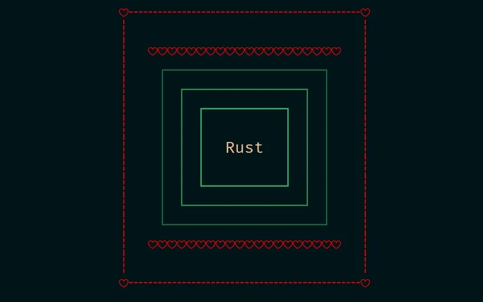
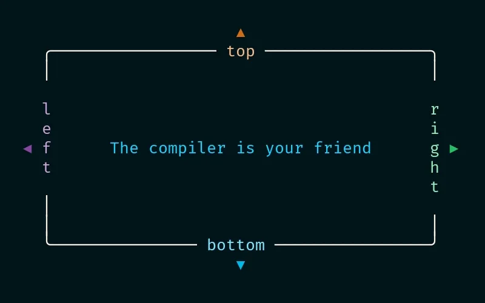

# ratatui-garnish

[](https://crates.io/crates/ratatui-garnish)
[](https://docs.rs/ratatui-garnish)
[](https://github.com/franklaranja/ratatui-garnish/issues)
[](https://github.com/franklaranja/ratatui-garnish/actions/workflows/ci.yml)
[](https://github.com/franklaranja/ratatui-garnish)
[](LICENSE)

<div align="center">

*Garnish your Ratatui Widgets*

</div>

`ratatui-garnish` is a powerful composition system for [Ratatui](https://ratatui.rs) widgets,
allowing you to change de rendering of any widget with garnishes like borders, titles, shadows,
padding, and styles in a flexible, type-safe way. Layer multiple
garnishes in any order, apply them at runtime, and modify them
without altering the underlying widget. With zero-cost abstractions
and no trait objects, `ratatui-garnish` ensures performance
and type safety.

Want a margin outside a border? Add `Padding` before a border. Need
multiple titles or a shadow effect? Just garnish! Writing custom
widgets but dreading the boilerplate for styling or borders?
Use `ratatui-garnish` with any widget implementing
`Widget` or `StatefulWidget`.

## Features

- **Composable Modifications**: Layer borders, titles, shadows, padding,
  and styles in any order.
- **Type-Safe**: No trait objects or dynamic dispatch, preserving
  Rust's type system.
- **Zero-Cost Abstractions**: Efficient rendering with no overhead
  for unused garnishes.
- **Flexible**: Apply or modify garnishes at runtime.
- **Seamless Integration**: Works with any Ratatui widget.

## Installation

Add `ratatui-garnish` to your `Cargo.toml`:

```toml
[dependencies]
ratatui-garnish = "0.1.0"
ratatui = "0.29"
```

## Usage

Import the `GarnishableWidget` trait to add the `garnish` method to
any Ratatui widget:

```rust
use ratatui::{style::{Color, Style}, text::Text};
use ratatui_garnish::{
    border::RoundedBorder,
    Padding,
    GarnishableWidget
    title::{Title, Above},
};

// Create a text widget with multiple decorations
let widget = Text::raw("Hello, World!\nTasty TUIs from Ratatui")
    .garnish(RoundedBorder::default())           // Add a rounded border
    .garnish(Title::<Above>::raw("My App"))      // Add a title above
    .garnish(Style::default().bg(Color::Blue))   // Set a background color
    .garnish(Padding::uniform(1));               // Add padding inside
```

Garnishes are applied in the order they are added, with `before_render`
effects (e.g., styles, shadows) applied first, followed by the widget,
and then `after_render` effects (e.g., titles over borders).

### Complex Example

Combine multiple garnishes for a polished UI:

```rust
use ratatui::{style::{Color, Style, Modifier}, text::Line};
use ratatui_garnish::{
    border::DoubleBorder,
    GarnishableWidget,
    Paddng,
    shadow::Shadow,
    title::{Title, Top, Bottom},
};

let widget = Line::raw("Important Message")
    .garnish(Padding::uniform(2))                       // Margin outside
    .garnish(Style::default().bg(Color::DarkGray))      // Background color
    .garnish(Title::<Top>::styled("⚠ WARNING ⚠",        // Styled title
        Style::default().fg(Color::Red).add_modifier(Modifier::BOLD)).margin(1))
    .garnish(Title::<Bottom>::raw("Status: Active").right_aligned().margin(1))
    .garnish(DoubleBorder::default());                   // Double border
```


### Reusing Garnishes

Use the `Garnishes` vector to apply the same garnishes to multiple widgets:

```rust
use ratatui::{style::{Color, Style, Modifier}, text::Line};
use ratatui_garnish::{
    border::DoubleBorder,
    garnishes, GarnishableWidget, Padding,
    title::{Title, Top},
};

let garnishes = garnishes![
    Style::default().fg(Color::Blue),
    DoubleBorder::default(),
    Padding::uniform(2),
    Style::default().fg(Color::White),
];

let mut widget1 = Line::raw("First Widget")
    .garnish(Title::<Top>::styled("First", Style::default().fg(Color::Red).add_modifier(Modifier::BOLD)).margin(1));
widget1.extend_from_slice(&garnishes);

let mut widget2 = Line::raw("Second Widget")
    .garnish(Title::<Top>::styled("Second", Style::default().fg(Color::Green).add_modifier(Modifier::BOLD)).margin(1));
widget2.extend(garnishes);
```

Or construct `GarnishedWidget` directly from a widget with
`Garnishes` using the `GarnishableWidget` trait:

```rust
let widget = Line::raw("Widget")
    .garnishes( garnishes![
        Style::default().fg(Color::Blue),
        DoubleBorder::default(),
        Padding::uniform(2),
        Style::default().fg(Color::White),
    ] );

// copy garnishes of widget to other_widget
let other_widget = Line::raw("Other Widget")
    .garnishes_from_slice(widget.as_slice());
```

### Accessing Garnishes

Treat a `GarnishedWidget` like a `Vec` to inspect or modify its garnishes:

```rust
let widget = Line::raw("Test")
    .garnish(Style::default().bg(Color::Blue))
    .garnish(Padding::uniform(1));
assert!(widget[0].is_style());
assert_eq!(widget.first_padding(), Some(&Padding::uniform(1)));
```

## Available Garnishes

### Borders
- **Standard**: `PlainBorder`, `RoundedBorder`, `DoubleBorder`, `ThickBorder`
- **Dashed Variants**: `DashedBorder`, `RoundedDashedBorder`, `ThickDashedBorder`,
- **Custom**: `CharBorder` (single character, e.g., `****`), `CustomBorder` (custom character set)
- **Specialty**: `QuadrantInsideBorder`, `QuadrantOutsideBorder`, `FatInsideBorder`, `FatOutsideBorder`

### Titles
- **Horizontal**: `Title<Top>` (over top border), `Title<Bottom>` (over bottom border),
  `Title<Above>` (reserves space above), `Title<Below>` (reserves space below)
- **Vertical**: `Title<Left>` (over left border), `Title<Right>` (over right border),
  `Title<Before>` (reserves space left), `Title<After>` (reserves space right)

### Shadows
- `Shadow`: Light (`░`), medium (`▒`), dark (`▓`), or full (`█`) shades with full-character offsets
- `HalfShadow`: Full (`█`) or quadrant characters (e.g., `▗`) with half-character offsets

### Padding
- `Padding`: Spacing around the widget.

### Built-in Ratatui Support
- `Style`: Background colors, text styling

## Recipes

Here are some examples with screenshots of what you can do with **ratatui-garnish**.
I only show the garnishes used, the complete code can
be found in the examples directory.

### Padding

This example shows a combination of `Style` and `Padding`
garnishes on a `ratatui::text::Line` widget.

<div class="center">
 
</div>

```rust
garnishes![
    Style::default().bg(ORANGE400),
    Padding::vertical(1),
    Style::default().bg(ORANGE600),
    Padding::horizontal(2),
    Style::default().bg(BLUE100),
    Padding::left(2),
    Style::default().bg(BLUE200),
    Padding::top(1),
    Style::default().bg(BLUE300),
    Padding::right(2),
    Style::default().bg(BLUE400),
    Padding::bottom(1),
    Style::default().bg(BLUE500),
    Padding::left(2),
    Style::default().bg(BLUE600),
    Padding::top(1),
    Style::default().bg(BLUE700),
    Padding::right(2),
    Style::default().bg(BLUE800),
    Padding::bottom(1),
    Style::default().bg(BLUE900),
    Padding::top(1),

```

### Borders

You can add any combination of borders to a widget, in this
example it is again a `ratatui::text::Line`.

<div class="center">
  
</div>

```rust
garnishes![
    Style::default().fg(Color::Rgb(220, 0, 0)),
    CustomBorder::new(BorderSet::dashed().corners('♥')),
    Padding::proportional(1),
    CharBorder::new('♥').borders(Borders::TOP | Borders::BOTTOM),
    Padding::horizontal(1),
    Style::default().fg(GREEN700),
    PlainBorder::default(),
    Padding::horizontal(1),
    Style::default().fg(GREEN600),
    PlainBorder::default(),
    Padding::horizontal(1),
    Style::default().fg(GREEN500),
    PlainBorder::default(),
    Padding::top(1),
];
```

### Titles

This example shows the title garnishes, notice the difference
between titles that reserve space (the triangles) and those
that render over the border.

<div class="center">
    
</div>

```rust
garnishes![
    Title::<Above>::styled("▲", Style::default().fg(ORANGE500)).centered(),
    Title::<Below>::styled("▼", Style::default().fg(BLUE500)).centered(),
    Title::<Before>::styled("◀", Style::default().fg(PURPLE500)).centered(),
    Title::<After>::styled("▶", Style::default().fg(GREEN500)).centered(),
    Padding::horizontal(1),
    Title::<Top>::styled(" top ", Style::default().fg(ORANGE200)).centered(),
    Title::<Bottom>::styled(" bottom ", Style::default().fg(BLUE200)).centered(),
    Title::<Left>::styled(" left ", Style::default().fg(PURPLE200)).centered(),
    Title::<Right>::styled(" right ", Style::default().fg(GREEN200)).centered(),
    RoundedBorder::default(),
    Padding::top(4),
];
```

### Shadow

Here we add a `Title::<Above>` and a `HalfShadow` to a
`ratatui::widgets::Paragraph` widget.

<div class="center">
  
</div>

```rust
garnishes![
    Style::default().fg(BLUE600),
    HalfShadow::default(),
    Title::<Above>::styled(
        "From \"The Rust Programming Language\"",
        Style::default().bg(ORANGE400).fg(BLUE900)
    ).centered(),
    Style::default().bg(ORANGE100).fg(ORANGE700),
    Padding::proportional(2),
];
```

## Features

### Serde support

Serialization & deserialization using serde can be enabled using the cargo feature
`serde`. When it is enabled all garnishes, the `Garnish` enum and the `Garnishes`
`Vec` can be serialized and deserialized. This makes it easy to add theme support
to your application.

### Traditional decorator

The cargo feature `decorated widget` enables `DecoratedWidget` and
`DecoratedStatefulWidget` which wrap one widget with one garnish,
like the traditional decorator pattern. It offers little benefits
over `GarnishedWidget`. I use it to compare `GarnishedWidget` to,
e.g. in benchmarks.

## Performance

- Garnishes are applied in order, allowing precise control over rendering.
- Area modifications are accumulated efficiently.
- Zero-cost abstractions ensure no runtime overhead for unused garnishes.
- No dynamic dispatch or type erasure, preserving type safety and performance.

The benches directory contains two benchmarks using criterion.
`compare_compositions` compares 3 ways of decorating widgets:
the Ratatui way, traditional decorator and flat decorator.
The other one `traditional_and_flat_decorator` compares the two decorators
with different numbers of garnishes. Both need the `decorator_widget`
feature (for the traditional decorator pattern).

## Flat decorator design pattern

Ratatui-garnish uses a flat decorator. I wrote an article about
this pattern and the design of ratatui-garnish: [Garnish your
widgets: flexible, dynamic and type-safe composition in
Rust](https://franklaranja.github.io/articles/garnish-your-widgets/)

## Compatibility

`ratatui-garnish` integrates seamlessly with Ratatui widgets implementing
`Widget` or `StatefulWidget` following Ratatui's conventions.

## Contributing

This is the first release of `ratatui-garnish`, and more garnishes are
planned! Contributions are welcome.

## License

Licensed under the [MIT License](LICENSE). See the [LICENSE](https://github.com/username/ratatui-garnish/blob/main/LICENSE) file for details.

## Acknowledgements

Built with love for the Rust and Ratatui communities. Inspired by the
need for flexible, reusable widget modification.
